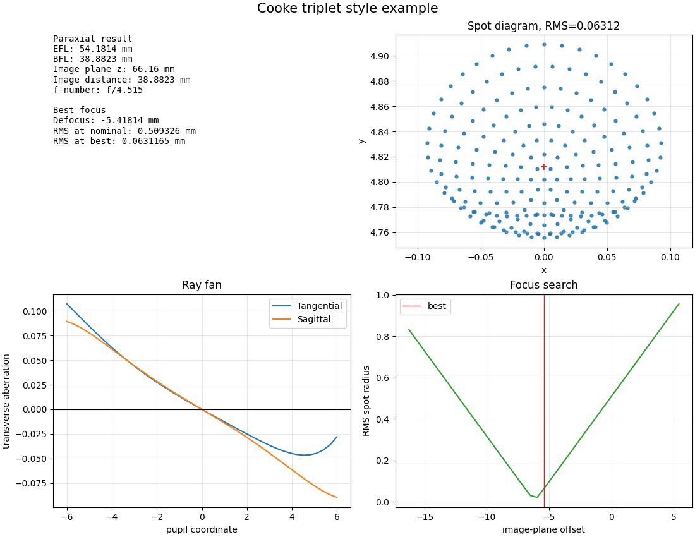

# Paraxial Optics Analyzer

[](https://github.com/JosefHobler/paraxial-optics-analyzer/actions/workflows/ci.yml)

Scriptable sequential ray tracing & image-quality analysis for centered spherical lens systems — a tiny open-source Zemax-style tool.

Two independent paraxial implementations (direct refraction-transfer trace + ABCD matrix) cross-validate against the thick-lens lensmaker equation. The real (non-paraxial) trace converges to the paraxial prediction in the small-aperture limit at ~1e-9.



## Features

- **Paraxial analysis** — direct refraction-transfer trace and ABCD-matrix readouts that agree to ~1e-13, validated against the thick-lens lensmaker equation.
- **Real ray tracing** — sequential trace through centered spheres + planes using vector Snell's law, with reversibility and total-internal-reflection handling.
- **Image quality** — hexapolar spot diagrams, tangential / sagittal ray fans referenced to the chief ray, golden-section best-focus search.
- **4-panel report** — matplotlib PDF/PNG (summary, spot, ray fan, focus-search curve).
- **YAML prescriptions** — Zemax-style row table; structural + semantic validation on load.
- **Pro CLI** — argparse subcommands (`info`, `report`, `validate`), per-command `--help`, `--version`, structured exit codes, one-line error messages with hints (no tracebacks on user errors).
- **Built-in physics self-checks** — `analyze validate` runs three end-to-end cross-validations from the command line.
- **CI gate** — every push runs ruff, the 103-test pytest suite on Python 3.10/3.11/3.12, the physics self-checks, and a wheel build smoke-tested in a clean venv.

## Install

Requires Python ≥ 3.10. Runtime deps: `numpy`, `matplotlib`, `pyyaml`.

```bash
pip install -e ".[dev]"
```

Or via the task runner:

```bash
make install
```

## Quick demo

```bash
make demo
```

Output:

```
>>> Running analysis on examples/singlet_bk7.yaml
Cooke triplet style example
  EFL: 54.1813925245 mm
  BFL: 38.8823263606 mm
  image distance: 38.8823263606 mm
  f-number: f/3.05874

  nominal image plane z:  66.16 mm
  paraxial focus z:       60.0423 mm   (shift from nominal: -6.118 mm)
  best-focus z:           60.2614 mm   (shift from paraxial: +0.2191 mm)

  RMS spot at nominal:     0.705092 mm
  RMS spot at paraxial:    0.044284 mm
  RMS spot at best focus:  0.035734 mm

>>> Built-in self-checks
Lensmaker validation: PASS, relative error < 1e-15
Paraxial-limit validation: PASS, max deviation 1.2e-13
Cooke triplet EFL check: PASS, relative error 3.9e-16
```

The three explicit `z` lines remove any ambiguity about what "best-focus shift" is measured against. RMS spots are reported at all three reference planes so the third-order-SA identities (`RMS_paraxial ≈ |TA_max|/2`, `RMS_best ≈ |TA_max|/6`, `shift ≈ −(2/3)·LSA`) line up with what you'd compute by hand — see [`tests/test_analysis.py::TestSphericalAberrationConvergence`](tests/test_analysis.py).

## CLI

Three subcommands. Run `analyze --help` for the top-level overview, `analyze <command> --help` for command-specific options.

```bash
analyze info examples/singlet_bk7.yaml                   # numeric results
analyze info examples/singlet_bk7.yaml --field-angle-deg 5
analyze report examples/singlet_bk7.yaml -o cooke.pdf  # write PDF/PNG report
analyze validate                                         # built-in self-checks
analyze --version
```

Top-level help:

```
$ analyze --help
usage: analyze [-h] [--version] <command> ...

Paraxial optics analyzer — sequential ray tracing for centered lens systems.

options:
  -h, --help  show this help message and exit
  --version   show program's version number and exit

commands:
  <command>
    info      print first-order properties and spot statistics
    report    write a 4-panel PDF/PNG report
    validate  run built-in physics self-checks

examples:
  analyze info examples/singlet_bk7.yaml
  analyze info examples/singlet_bk7.yaml --field-angle-deg 5
  analyze report examples/singlet_bk7.yaml -o cooke.pdf
  analyze validate
```

**Exit codes**: `0` ok, `2` bad input (prescription / args), `3` ray-trace failure (TIR, total vignetting, chief-ray failure). The CLI prints a one-line `error: ...` to stderr with a hint pointing at `--field-angle-deg` or aperture size — failures don't drop a traceback.

## Prescription format

A prescription is a YAML file with object specification, an ordered list of surfaces, and an aperture stop:

```yaml
name: Plano-convex singlet (BK7)
wavelength_um: 0.5876
units: mm

object:
  distance: .inf # +inf for collimated input; finite for object at distance
  height: 0.0

surfaces:
  - { radius: 50.0, thickness: 5.0, n: 1.5168, semi_diameter: 12.0 }
  - { radius: .inf, thickness: 91.75, n: 1.0, semi_diameter: 12.0 }

stop: 1 # 1-indexed surface number serving as the aperture stop
```

Per surface:

- `radius` — signed radius of curvature, `±inf` for plano. Positive when the centre of curvature lies downstream of the surface.
- `thickness` — axial distance to the next surface, `≥0` (zero allowed for cemented surfaces).
- `n` — refractive index of the medium _after_ this surface, `≥1`.
- `semi_diameter` — clear-aperture half-width, `>0`.

Validation runs on load — bad units, NaN, negative thickness, radius=0, booleans coerced as numbers, missing keys, etc. raise `PrescriptionError` with a precise message about _which_ surface and _which_ field.

See [`examples/singlet_bk7.yaml`](examples/singlet_bk7.yaml) and [`examples/singlet_bk7.yaml`](examples/singlet_bk7.yaml).

## Validation strategy

Three layers of cross-validation make this more than a unit-tested toy:

1. **Lensmaker ↔ paraxial trace.** Direct refraction-transfer trace of `(y=1, u=0)` through every surface; EFL read off the output slope. Must match the closed-form thick-lens lensmaker equation `1/f = (n-1)·(1/R₁ - 1/R₂ + (n-1)·d/(n·R₁·R₂))` to machine precision (~1e-13).
2. **Direct trace ↔ ABCD matrix.** Independent code path accumulating a 2×2 ABCD matrix in the reduced-angle `[y, n·u]` convention; EFL/BFL read off the matrix as `-n_last/C` and `-A·n_last/C`. Must match the direct trace to ~1e-13.
3. **Real trace → paraxial focus.** Vector-Snell trace at small pupil heights converges on the paraxial focus with the residual scaling like y³ (third-order spherical aberration). At y = 1e-3 the residual is < 1e-9 — the headline real-vs-paraxial claim.

`analyze validate` exposes these as a user-facing CLI command:

```
Lensmaker validation: PASS, relative error < 1e-15
Paraxial-limit validation: PASS, max deviation 1.2e-13
Cooke triplet EFL check: PASS, relative error 3.9e-16
```

CI runs the same checks on every push, so numerical drift past the project thresholds breaks the build.

## Make targets

| target          | what it does                                                      |
| --------------- | ----------------------------------------------------------------- |
| `make install`  | editable install with dev deps (pytest, ruff)                     |
| `make test`     | run the pytest suite                                              |
| `make demo`     | run the headline analysis + built-in self-checks                  |
| `make report`   | write a 4-panel PDF report (summary, spot, ray fan, focus search) |
| `make lint`     | static checks with ruff                                           |
| `make validate` | only the physics self-checks                                      |
| `make clean`    | drop `__pycache__`, `*.egg-info`, `.pytest_cache`, `.ruff_cache`  |

Pick a different prescription with `EXAMPLE=`:

```bash
make report EXAMPLE=examples/singlet_bk7.yaml REPORT=cooke.pdf
```

## Continuous integration

Every push and pull request kicks off [`.github/workflows/ci.yml`](.github/workflows/ci.yml). Three jobs run, with the build job gated on the first two:

- **lint** — `ruff check src tests` (`E`/`F`/`W`/`I`/`UP`/`B` rules, line-length 100).
- **tests** _(matrix)_ — full pytest suite on Python 3.10, 3.11, and 3.12, followed by `analyze validate`. The explicit validate step puts the physics cross-checks on the CI log so any drift past ~1e-9 immediately fails the build.
- **build wheel** — builds `sdist` + `wheel`, installs the wheel into a fresh venv, runs `analyze --version` and `analyze validate` against it, and uploads `dist/` as a 7-day downloadable artefact.

Concurrent runs on the same branch are cancelled automatically so only the latest commit's status counts. Pip caches across runs for a second-run install in seconds.

## Testing

103 pytest tests across:

| file                   | what it covers                                                                |
| ---------------------- | ----------------------------------------------------------------------------- |
| `test_prescription.py` | dataclass validation (NaN, sign, range, frozen-ness)                          |
| `test_io.py`           | YAML loader: required keys, type coercion, `.inf` parsing, bool rejection     |
| `test_paraxial.py`     | lensmaker agreement, direct ↔ ABCD agreement, Gaussian imaging equation       |
| `test_raytrace.py`     | vector Snell primitives, time-reversal symmetry, TIR, y³ convergence          |
| `test_sampling.py`     | hexapolar count formula, linear sweep symmetry, launch geometry               |
| `test_analysis.py`     | spot symmetry on-axis, ray-fan odd-function property, best-focus monotonicity |
| `test_cli_report.py`   | CLI subcommand behaviour, error paths, PDF/PNG report generation              |
| `test_validate.py`     | each self-check, formatter edge cases, CLI invocation of `validate`           |

`tests/conftest.py` pins matplotlib to the non-interactive `Agg` backend so report tests run headlessly on any OS.

## Project layout

```
.
├── .github/workflows/ci.yml      # CI: lint + tests (py3.10-3.12) + wheel build
├── examples/
│   ├── singlet_bk7.yaml          # plano-convex BK7 singlet (headline example)
│   └── singlet_bk7.yaml        # 3-element Cooke-style triplet
├── src/paraxial_optics_analyzer/
│   ├── __init__.py
│   ├── analysis.py               # spot diagram, ray fan, best-focus search
│   ├── cli.py                    # argparse subcommands: info / report / validate
│   ├── io.py                     # YAML loader + dict coercion
│   ├── paraxial.py               # direct trace + ABCD matrix + lensmaker eq
│   ├── prescription.py           # frozen-dataclass schema + validation
│   ├── raytrace.py               # vector Snell, sequential trace
│   ├── report.py                 # 4-panel matplotlib PDF/PNG
│   ├── sampling.py               # hexapolar pupil + parallel-bundle launches
│   └── validate.py               # built-in physics self-checks
├── tests/                        # 103 pytest tests + conftest.py
├── Makefile
├── pyproject.toml                # PEP 621 metadata, ruff + pytest config
├── LICENSE
└── README.md
```

## Sign & coordinate conventions

- `+z` is the optical axis, pointing from object to image.
- Surface radius is **signed**: positive when the centre of curvature lies downstream of the surface vertex; `±inf` denotes a plane.
- ABCD matrix is in the **reduced-angle** convention — state vector is `[y, n·u]`. For a centered system bounded by index `n_in` in object space and `n_out` in image space, `det(M) = n_in / n_out`, which is `1` for the common air-to-air case.
- EFL is positive for a converging system. BFL is signed from the last surface vertex to the rear focal point.
- Field angle is measured from the optical axis in the tangential (y-z) meridian by default; sagittal sampling is along x.

## License

MIT — see [`LICENSE`](LICENSE).
